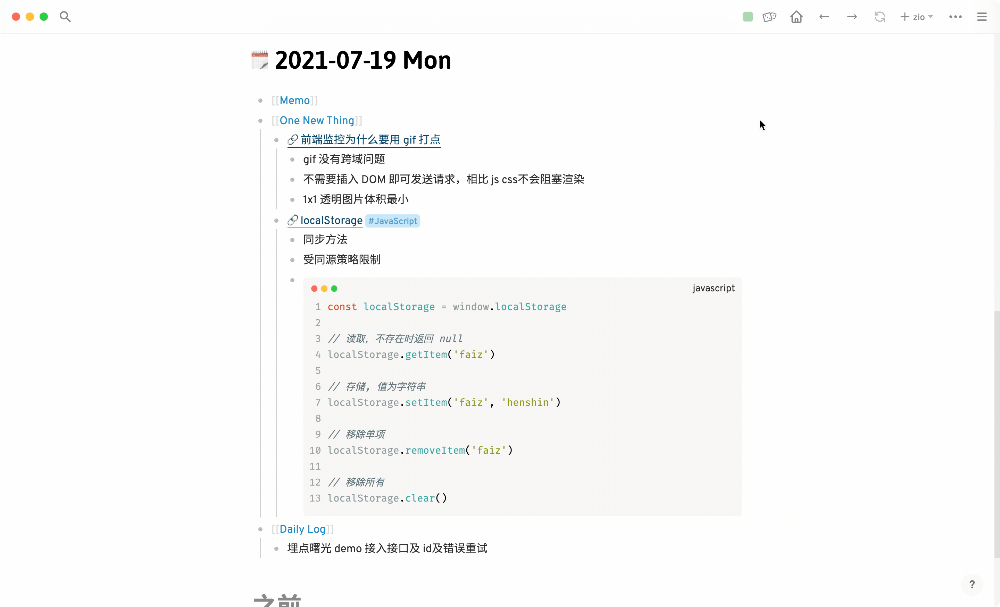

# logseq-plugin-random-walk

点击按钮随机跳转一篇笔记

## Demo

## Install And Use
1. turn on Logseq developer mode
2. [download package](https://github.com/haydenull/logseq-plugin-random-walk/releases)
3. unzip the zip file and load from Logseq plugins page